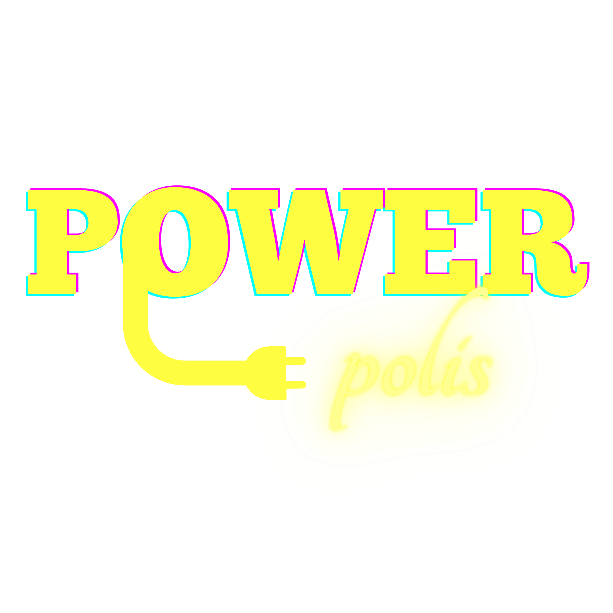

<div align="center">

# ⚡ Powerpolis ·  EnergiAI

### Inteligência Artificial para Classificação de Eficiência Energética

**Hackathon ONE G9 - Alura + Oracle**

<a href="https://alura-es-cursos.github.io/projetos-hackathon-g9-brasil/">
  
</a>

<br>


🌐 Leia em outro idioma: <a href="docs/README.en.md">English</a> | <a href="docs/README.es.md">Español</a>

</div>

---

##  Sobre o Projeto

> _"O projeto Powerpolis (EnergiAI) ajuda clientes sustentáveis a analisar o consumo de energia, descobrindo a fonte dos gastos mensais através da categorização de eficiência energética. A solução será tratada de forma preditiva e assertiva com o uso de IA para conectar consumidores conscientes a soluções ideais de energia solar."_

O **Powerpolis** é a solução da equipe **G9-BR-TEAM-12** para o desafio **EnergiAI**: uma aplicação que recebe dados de consumo energético de uma residência ou pequeno estabelecimento e, usando um modelo de Machine Learning treinado do zero pela equipe, classifica o perfil em **Eficiente, Moderado ou Ineficiente** e ainda gera recomendações personalizadas de otimização e uma estimativa de custo mensal, tudo entregue via **API REST**, com integração à **Oracle Cloud Infrastructure (OCI)**.

---

## 🎯 O Desafio

Desenvolver em 6 semanas um **MVP** funcional capaz de:

1. Analisar padrões de consumo energético e classificar perfis de eficiência;
2. Gerar recomendações práticas de melhoria;
3. Estimar impactos financeiros com base em uma tarifa de referência;
4. Disponibilizar os resultados por meio de uma API REST;
5. Utilizar a infraestrutura da **OCI** como parte da arquitetura da solução.

**A dor real por trás do desafio:** muitas pessoas recebem contas de energia elevadas, mas têm pouca visibilidade sobre quais hábitos e equipamentos mais pesam na conta. O Powerpolis existe para transformar dados brutos de consumo em decisões conscientes, assim podendo entender o próprio perfil, identificar desperdício, receber recomendações e acompanhar a evolução ao longo do tempo.

---

## ⚙️ Como Funciona

**Endpoint principal:**
```
POST /analise-energetica
```

**Exemplo de entrada:**
```json
{
  "consumo_kwh": 420,
  "uso_horario_pico": true,
  "quantidade_equipamentos": 10,
  "tipo_imovel": "Casa",
  "horas_alto_consumo": 8
}
```

**Exemplo de saída (validado contra o modelo real treinado):**
```json
{
  "categoria": "Ineficiente",
  "probabilidade": 0.5287,
  "recomendacoes": [
    "Alerta Vermelho! Auditoria energética completa necessária.",
    "Substitua equipamentos antigos por modelos eficientes.",
    "Implemente automação para controle de energia."
  ],
  "custo_estimado_mensal": 315.00
}
```

### Arquitetura

| Camada | Tecnologia |
|---|---|
| Frontend | React + Vite (interface web responsiva) |
| Backend | Java 21 + Spring Boot (orquestra a requisição e expõe a API) |
| Serviço de IA | Python + FastAPI (encapsula o modelo treinado) `POST /predict` |
| Ciência de Dados | Python + Pandas + Scikit-Learn (Random Forest) |
| Infraestrutura | Docker Compose + Oracle Cloud Infrastructure (OCI) |

O Backend nunca reimplementa a inteligência do produto, pois toda classificação, recomendação e cálculo de custo é responsabilidade do serviço de IA. Caso a FastAPI esteja offline, o frontend possui um fallback implementado.

---

## 🔍 Destaques Técnicos

- **Modelo treinado do zero:** Random Forest com features de interação, **61,94% de acurácia** no conjunto de teste, comparado formalmente contra Regressão Logística e Árvore de Decisão antes da escolha final.
- **Critério de classificação com justificativa estatística:** os limiares de Eficiente/Moderado/Ineficiente são calculados por quartil de consumo, **dentro de cada tipo de imóvel**, evitando comparar uma indústria com um apartamento na mesma régua.
- **Dataset simulado com rigor:** 50.000 registros gerados de forma determinística (seed fixa), com decisões de escopo documentadas, inclusive a exclusão consciente de variáveis de clima, para manter a API aderente ao edital.
- **4 serviços OCI integrados por decisão de arquitetura:** Object Storage, Autonomous Database e Vault.
- **Ambiente containerizado e validado de ponta a ponta:** Backend e serviço de IA sobem juntos via Docker Compose, testado com chamadas reais, não apenas os containers subindo sem erro.

---

## 👥 Equipe — G9-BR-TEAM-12

| Integrante | Papel | Links |
|---|---|---|
| **Alan Anderson** | Backend Developer | <a href="https://www.linkedin.com/in/alan-anderson-dev/"></a> <a href="https://github.com/alanandersondev"></a> |
| **Alex Furukawa** | Full Stack Developer | <a href="https://www.linkedin.com/in/lexkawa/"></a> <a href="https://github.com/dev-corvus/"></a> |
| **Antônio Carlos Martins Teixeira** | Frontend Developer | <a href="https://www.linkedin.com/in/antonio-carlos-martins-teixeira"></a> <a href="https://github.com/digichargeac"></a> |
| **Kauã da Silva Barros** | Backend Developer | <a href="https://www.linkedin.com/in/kauabarros/"></a> <a href="https://github.com/kaua3-c"></a> |
| **Lídia Moura** | Data Analyst · Líder do time | <a href="https://www.linkedin.com/in/lidimoura/"></a> <a href="https://github.com/lidimoura"></a> |
| **Pedro Henrique Tireli** | Data Scientist | <a href="https://www.linkedin.com/in/phtirelli/"></a> <a href="https://github.com/phtirelli"></a> |
| **Samanta Sá** | Backend Developer · Scrum Master | <a href="https://www.linkedin.com/in/engsamantasa/"></a> <a href="https://github.com/engsamantasa"></a> |

A equipe circula entre áreas: o trio **Lídia, Samanta e Alex** conduz as decisões de arquitetura; **Kauã** apoia o front-end quando necessário; **Alex**, como full stack, também reforça o backend. Essa colaboração cruzada ajudou o time a colaborar com níveis de senioridade distintas e como cada área se comunicaria com o projeto.

---

## 💼 Modelo de Negócio e Aplicação de Mercado

> **Direção estratégica (ainda não implementada):** faz parte da visão de produto para as próximas fases.

Além do uso direto pelo consumidor final, o Powerpolis abre uma segunda frente de valor: perfis classificados como **Moderado** ou **Ineficiente** representam justamente o público com maior potencial de economia ao migrar para energia solar. Esse público representa um mercado com grande potencial de receita, tornando a classificação, um mecanismo natural de **qualificação de leads** para empresas do setor de placas solares. A equipe validou essa direção como próximo passo de produto, com potencial de gerar valor tanto para o usuário final (economia) quanto para parceiros comerciais (leads qualificados por dado real de consumo, não por formulário genérico).

---

## 🗺️ Roadmap Pós-Hackathon

**Ciência de Dados:** migração para dataset com dados reais (fontes públicas como UCI Household Power Consumption e IEEE DataPort), pipeline de produção via `sklearn.Pipeline`, retreinamento periódico do modelo, avaliação de Gradient Boosting (XGBoost/LightGBM) e dashboard de BI para acompanhamento das predições.

**Produto:** login e histórico de consumo do usuário com gráficos de evolução, e integração com dispositivos de casas inteligentes (IoT) para leitura automática de consumo. Além de uma feature para gamificação, onde usuários acumulam pontos por ações que reduzem o consumo.

---

## 📌 Transparência

Partes do desenvolvimento e organização do notebook de Ciência de Dados contaram com apoio de ferramentas de IA (Gemini, integrado ao Google Colab e Antigravity IDE; Copilot, integrado no VS Code) para organização, formatação e auditoria de consistência. Todas as decisões técnicas: critérios de classificação, escolha de features e configuração final do modelo foram definidas e validadas pela equipe.

---

<div align="center">

**[Hackathon ONE G9 — Alura + Oracle](https://alura-es-cursos.github.io/projetos-hackathon-g9-brasil/)**

</div>
