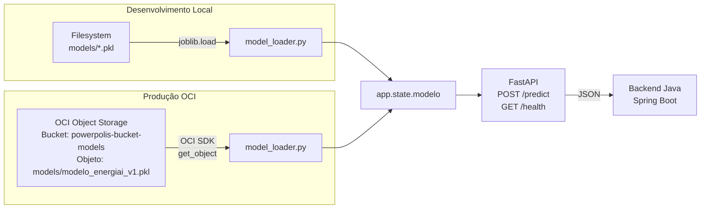
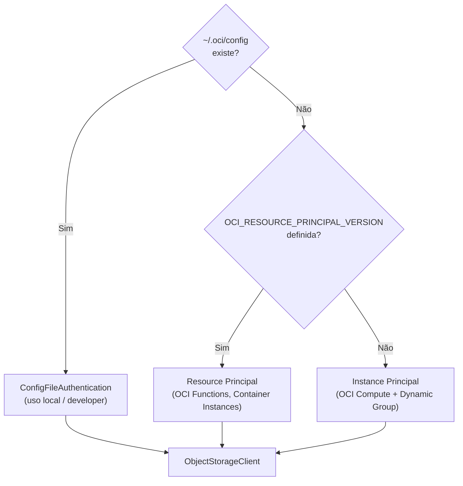

# Integração do Modelo ML com OCI Object Storage

## Visão Geral

O serviço FastAPI **EnergiAI** carrega o modelo `RandomForestClassifier` (`.pkl`) no **startup** e o mantém em memória para servir predições via `POST /predict`. O módulo `model_loader.py` abstrai a origem do modelo, suportando duas fontes:

| `MODEL_SOURCE` | Descrição | Quando usar |
|---|---|---|
| `local` (padrão) | Lê o arquivo `.pkl` do sistema de arquivos | Desenvolvimento, Docker Compose |
| `oci` | Baixa do OCI Object Storage via SDK | Produção na OCI, teste local com OCI |

> **Sobre o modelo:** O PowerPolis utiliza um `RandomForestClassifier` treinado para classificar os perfis de consumo energético. O modelo atual foi serializado diretamente com `joblib` no arquivo `modelo_energiai_v1.pkl` e está funcional localmente e quando carregado do OCI Object Storage. Nesta versão, o artefato **não** é um `sklearn.pipeline.Pipeline`. A adoção futura de um Pipeline com pré-processamento encapsulado poderá ser avaliada em uma nova versão do modelo.

---

## Arquitetura



---

## Variáveis de Ambiente

Definidas em [`.env.example`](../data-science/app/.env.example):

| Variável | Default | Descrição |
|---|---|---|
| `MODEL_SOURCE` | `local` | Fonte do modelo: `local` ou `oci` |
| `MODEL_LOCAL_PATH` | `models/modelo_energiai_v1.pkl` | Caminho do `.pkl` no filesystem |
| `OCI_REGION` | `sa-saopaulo-1` | Região OCI |
| `OCI_NAMESPACE` | `grclodnfw2hl` | Namespace do Object Storage |
| `OCI_OBJECT_STORAGE_BUCKET` | `powerpolis-bucket-models` | Nome do bucket |
| `OCI_MODEL_OBJECT_NAME` | `models/modelo_energiai_v1.pkl` | Caminho do objeto no bucket |

---

## Autenticação OCI (Cascata)

O `model_loader.py` tenta autenticar na OCI seguindo esta ordem (sem credenciais no código):



### Pré-requisitos OCI para produção

1. **Dynamic Group** que inclua a instância/container:
   ```
   ALL {resource.type = 'computeinstance', resource.compartment.id = '<compartment_ocid>'}
   ```

2. **IAM Policy** permitindo acesso ao bucket:
   ```
   Allow dynamic-group <nome-do-dynamic-group> to read objects in compartment <compartment_name> where target.bucket.name='powerpolis-bucket-models'
   ```

3. O bucket permanece **PRIVADO** — a criptografia com OCI Vault é transparente para o SDK.

---

## Como Executar

### Desenvolvimento Local (sem OCI)

```bash
cd data-science/app

# O modelo .pkl já deve estar em models/modelo_energiai_v1.pkl
MODEL_SOURCE=local uvicorn src.model_service.main:app --host 0.0.0.0 --port 8000 --reload
```

### Docker Compose

```bash
cd infra
docker compose up --build model-service
```

O `docker-compose.yml` já configura `MODEL_SOURCE=local` e o `Dockerfile` copia a pasta `models/` para dentro do container.

### Modo OCI (com ~/.oci/config local)

```bash
cd data-science/app
MODEL_SOURCE=oci uvicorn src.model_service.main:app --host 0.0.0.0 --port 8000
```

Requer `~/.oci/config` configurado com acesso ao bucket. O arquivo **NÃO** é commitado no Git.

### Produção OCI (Instance/Resource Principal)

Defina as variáveis de ambiente no deploy (OCI Container Instance, Compute, Functions):

```bash
MODEL_SOURCE=oci
OCI_REGION=sa-saopaulo-1
OCI_NAMESPACE=grclodnfw2hl
OCI_OBJECT_STORAGE_BUCKET=powerpolis-bucket-models
OCI_MODEL_OBJECT_NAME=models/modelo_energiai_v1.pkl
```

A autenticação ocorre automaticamente via Instance/Resource Principal — sem `~/.oci/config`.

---

## Verificação

```bash
# Health check
curl http://localhost:8000/health
# Esperado: {"status": "ok", "modelo_carregado": true}

# Predição
curl -X POST http://localhost:8000/predict \
  -H "Content-Type: application/json" \
  -d '{
    "consumo_kwh": 350.0,
    "uso_horario_pico": true,
    "quantidade_equipamentos": 15,
    "tipo_imovel": "Comercial",
    "horas_alto_consumo": 6.5
  }'
```

### Cenários Canônicos de Teste (do contrato de API)

**1 — Casa com consumo eficiente**
```json
// entrada
{ "consumo_kwh": 300, "uso_horario_pico": false, "quantidade_equipamentos": 5, "tipo_imovel": "Casa", "horas_alto_consumo": 3 }
// saída esperada
{ "categoria": "Eficiente", "probabilidade": 0.7389, "recomendacoes": ["Excelente desempenho! Continue monitorando.", "Considere investimentos em energia renovável.", "Explore a certificação de eficiência."], "custo_estimado_mensal": 225.00 }
```

**2 — Estabelecimento comercial com consumo moderado**
```json
// entrada
{ "consumo_kwh": 700, "uso_horario_pico": true, "quantidade_equipamentos": 12, "tipo_imovel": "Comercial", "horas_alto_consumo": 8 }
// saída esperada
{ "categoria": "Moderado", "probabilidade": 0.7025, "recomendacoes": ["Potencial de melhoria! Faça uma auditoria energética.", "Otimize o uso do ar-condicionado.", "Invista em equipamentos mais eficientes."], "custo_estimado_mensal": 525.00 }
```

**3 — Cenário oficial do edital**
```json
// entrada
{ "consumo_kwh": 420, "uso_horario_pico": true, "quantidade_equipamentos": 10, "tipo_imovel": "Casa", "horas_alto_consumo": 8 }
// saída esperada
{ "categoria": "Ineficiente", "probabilidade": 0.5287, "recomendacoes": ["Alerta Vermelho! Auditoria energética completa necessária.", "Substitua equipamentos antigos por modelos eficientes.", "Implemente automação para controle de energia."], "custo_estimado_mensal": 315.00 }
```

> Nota: o edital usa `0.81` como probabilidade ilustrativa — o valor real do modelo treinado é `0.5287`.

**Campos obrigatórios na resposta:** `categoria`, `probabilidade`, `recomendacoes`, `custo_estimado_mensal`.

---

## Testes Unitários

```bash
cd data-science/app
python -m pytest tests/test_model_loader.py -v
```

Os testes usam `unittest.mock` para simular o OCI SDK — não requerem conectividade real com a OCI.

---

## Onboarding para a Equipe — Teste Local com Modelo na OCI

**Objetivo:** cada integrante da equipe G9-BR-TEAM-12 deve conseguir subir a API localmente com `MODEL_SOURCE=oci`, autenticando no OCI Object Storage com sua própria API key.

### Pré-requisitos

1. Python 3.11 com venv configurado no projeto.
2. Dependências do `requirements.txt` instaladas (inclui `oci>=2.133.0`).
3. Acesso ao compartment `powerpolis` e ao bucket `powerpolis-bucket-models` na OCI — o grupo `team-powerpolis` possui permissão de leitura. Confirme sua participação no grupo na Console OCI.

### Passo 1 — Criar API Key individual na OCI

Cada integrante deve criar sua própria API key na Console OCI:

1. Acesse **Perfil do usuário** → **API Keys** → **Add API Key**.
2. Escolha **Generate API Key Pair** (ou faça upload de chave pública existente).
3. Faça download do arquivo `.pem` (chave privada).
4. Copie o snippet de configuração exibido pela Console.

> ⚠️ **Nunca compartilhe sua chave privada (`.pem`) ou seu `~/.oci/config` com ninguém — nem por Discord, e-mail, GitHub ou commit.**

### Passo 2 — Configurar `~/.oci/config`

Crie o arquivo `~/.oci/config` (em `C:\Users\<seu_usuario>\.oci\config` no Windows) com o snippet copiado. Exemplo de estrutura (valores reais variam por integrante):

```ini
[DEFAULT]
user=ocid1.user.oc1..<SEU_OCID_DE_USUARIO>
fingerprint=<SEU_FINGERPRINT>
key_file=C:\Users\<seu_usuario>\.oci\<nome-da-sua-chave>.pem
tenancy=ocid1.tenancy.oc1..<OCID_DA_TENANCY>
region=sa-saopaulo-1
```

- O `key_file` deve apontar para o arquivo `.pem` que você baixou.
- Garanta que o `.pem` e o `~/.oci/config` **não estejam dentro do repositório** (o `.gitignore` já exclui `.oci/`).

### Passo 3 — Instalar dependências

```bash
cd data-science/app
python -m pip install -r requirements.txt
```

Confirme que o `oci` está instalado:

```bash
python -c "import oci; print(oci.__version__)"
# Esperado: 2.133.0 ou superior
```

### Passo 4 — Subir a API com MODEL_SOURCE=oci

No Windows (PowerShell):

```powershell
cd data-science\app
$env:MODEL_SOURCE="oci"
python -m uvicorn src.model_service.main:app --host 0.0.0.0 --port 8000
```

No Linux/macOS:

```bash
cd data-science/app
MODEL_SOURCE=oci uvicorn src.model_service.main:app --host 0.0.0.0 --port 8000
```

### Passo 5 — Validar

```bash
# Health check
curl http://localhost:8000/health
# Esperado: {"status": "ok", "modelo_carregado": true}

# Predição (cenário oficial do edital)
curl -X POST http://localhost:8000/predict \
  -H "Content-Type: application/json" \
  -d '{"consumo_kwh": 420, "uso_horario_pico": true, "quantidade_equipamentos": 10, "tipo_imovel": "Casa", "horas_alto_consumo": 8}'
# Esperado: {"categoria": "Ineficiente", "probabilidade": 0.5287, ...}
```

### Evidências que cada integrante deve enviar

1. Screenshot do terminal mostrando `INFO: Application startup complete.` sem erro de carregamento.
2. Resposta do `GET /health` com `"modelo_carregado": true`.
3. Resposta do `POST /predict` com os 4 campos obrigatórios.

> **Não inclua** prints de `~/.oci/config`, chaves, fingerprints, OCIDs ou conteúdo do arquivo `.pem` em nenhuma evidência.

---

## Erros Comuns e Diagnóstico

| Erro | Causa provável | Solução |
|---|---|---|
| `ModuleNotFoundError: No module named 'oci'` | Pacote `oci` não instalado | `pip install "oci>=2.133.0"` |
| `ConfigFileNotFound` ou `FileNotFoundError ~/.oci/config` | Arquivo de config não criado | Siga o Passo 2 do onboarding |
| `ServiceError: NotAuthenticated` | Fingerprint ou chave PEM incorretos | Verifique se o `key_file` aponta para o `.pem` correto e se o fingerprint bate |
| `ServiceError: NotAuthorized` | Usuário sem permissão no bucket | Confirme que seu usuário faz parte do grupo `team-powerpolis` na Console OCI |
| `BucketNotFound` ou `ObjectNotFound` | Namespace, bucket ou nome do objeto errados | Confirme: namespace=`grclodnfw2hl`, bucket=`powerpolis-bucket-models`, objeto=`models/modelo_energiai_v1.pkl` |
| `DLL load failed` (Windows) | Política de Application Control bloqueando DLL do scipy temporariamente | Tente executar novamente — o bloqueio é intermitente e não indica erro de código |
| `modelo_carregado: false` no `/health` | Falha no download ou desserialização | Verifique os logs do terminal para o erro detalhado; o serviço entra em modo FALLBACK |

---

## Segurança — Regras de Ouro

1. **Nunca commite** no Git: `.env`, `~/.oci/config`, `*.pem`, tokens, senhas ou OCIDs sensíveis.
2. **Nunca compartilhe** credenciais por Discord, e-mail, Slack, Google Drive ou qualquer canal não criptografado.
3. **Cada integrante** usa sua própria API key — ninguém deve usar a chave de outra pessoa.
4. O `.gitignore` (raiz e `data-science/app`) já exclui `.env`, `.oci/` e `*.pkl` — **não remova essas regras**.
5. O bucket permanece **PRIVADO** — não o torne público.

---

## Estrutura de Arquivos Modificados

```
data-science/app/
├── .env.example                          # [NOVO] Template de variáveis de ambiente
├── .gitignore                            # [ATUALIZADO] Protege .env, .pkl, .oci/
├── requirements.txt                      # [ATUALIZADO] + oci>=2.133.0
├── models/
│   └── modelo_energiai_v1.pkl            # Inalterado (fonte local)
├── src/
│   └── model_service/
│       ├── model_loader.py               # [NOVO] Carregamento isolado (local + OCI)
│       └── main.py                       # [ATUALIZADO] lifespan + app.state.modelo
└── tests/
    └── test_model_loader.py              # [NOVO] Testes unitários com mocks

infra/
└── docker-compose.yml                    # [ATUALIZADO] + environment para model-service

docs/
└── oci-model-storage.md                  # Este documento
```
